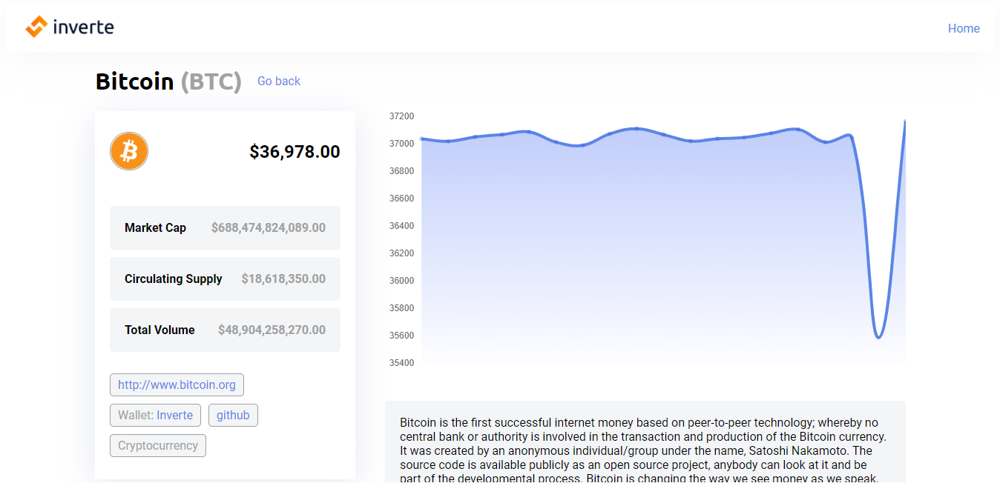

# Inverte Coin Info - React

> An easy top 100 coin explorer built with react.



## Built With

- React
- React Router Dom
- Redux
- JavaScript

## Live Demo

[Live Demo Link](https://inverte-coin-info.herokuapp.com/coin/binancecoin)

## Getting Started


To get a local copy up and running follow these simple example steps.

### Prerequisites

- Live Server plugin for Visual Studio Code 

### Setup

1- Clone the repository
```
    git clone https://github.com/elberthcorniell/inverte-coin-info.git
```

2- Open the folder. 
```
    cd inverte-coin-info
```

3- Run the app
```
    npm start
```

4- Everything should be running by now. 

### Testing
```
    npm test
```

## Author

👤 **Elbert Corniell**

- GitHub: [@elberthcorniell](https://github.com/elberthcorniell)
- Twitter: [@elberthcorniell](https://twitter.com/elberthcorniell)
- LinkedIn: [LinkedIn](https://www.linkedin.com/in/elbert-corniell-989183159/)

## Acknowledgments

- [Microverse](https://www.microverse.org/)

## 🤝 Contributing

Contributions, issues, and feature requests are welcome!

Feel free to check the [issues page](https://github.com/elberthcorniell/inverte-coin-info/issues).

## Show your support

Give a ⭐️ if you like this project!


## 📝 License

This project is [MIT](./LICENSE) licensed.
